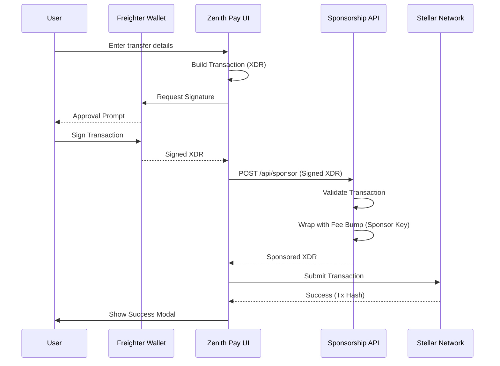
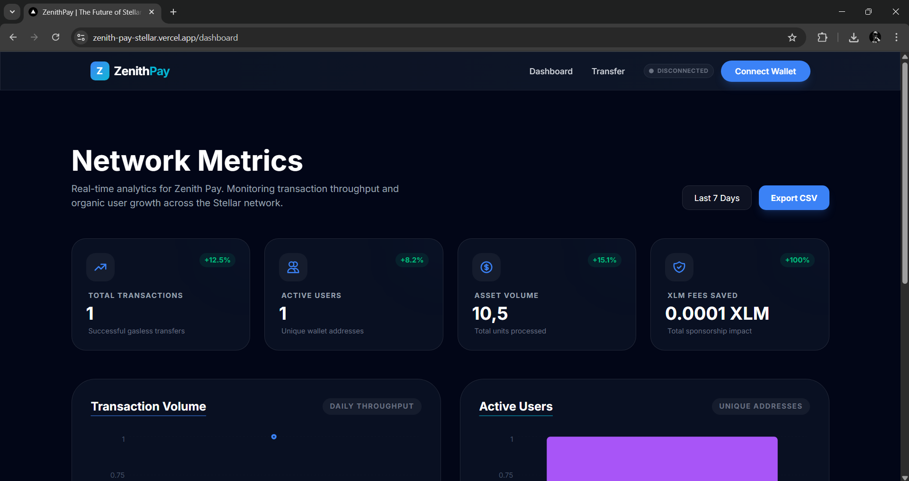

# 🌌 Zenith Pay - Gasless Stellar Payments

Zenith Pay is a premium fintech solution built on the Stellar network, enabling users to send assets globally with **zero network fees**. Our advanced fee sponsorship architecture handles the XLM costs, providing a seamless, "gasless" experience for everyone.

## 🔗 Live Demo & Presentation

- **Live Demo**: [zenith-pay-stellar.vercel.app](https://zenith-pay-stellar.vercel.app)
- **Demo Video**: [Zenith Pay - Gasless Stellar Demo](https://www.youtube.com/watch?v=Ua1FBjYgtPE)
- **Architecture Document**: [Zenith Pay Architecture](./ARCHITECTURE.md) (Optional)

## 🏗️ Architecture

## ✨ Key Features

- **🚀 Gasless Transfers**: Send XLM and other assets without needing native XLM for fees.
- **🎭 Animated UI**: Modern, responsive design with high-fidelity transaction feedback modals.
- **📊 Real-time Analytics**: Comprehensive dashboard showing network health and sponsorship impact.
- **🛡️ Secure & Non-Custodial**: We never touch your private keys. All signing happens locally via Freighter.
- **📑 Indexed History**: Lightning-fast retrieval of recent activity with direct explorer links.

## 🛠️ Technology Stack

- **Frontend**: Next.js 15, Tailwind CSS, Framer Motion
- **Visualization**: Recharts
- **Blockchain**: Stellar SDK, Freighter API
- **Observability**: Sentry Monitoring
- **Backend**: Next.js API Routes (Node.js)

## 📖 Documentation

- [User Guide](./USER_GUIDE.md) - How to use Zenith Pay.
- [Security Checklist](./SECURITY_CHECKLIST.md) - Audit report and security architecture.

## 🧪 Verifiable Test Wallets

The following wallets have successfully interacted with Zenith Pay on the Stellar Testnet:

| # | Wallet Address | Status | Activity |
|---|----------------|--------|----------|
| 1 | `GDC4OKZKW5BOOK4HHLPZFQ7GUWSHLRQYJYE56NSZPO65IANJFAZCXFMV` | Verified | Gasless Transfer |
| 2 | `GBBWVIQKMUE7D5Z5VUM27MKGB6X4XN4EBYQ22QCOSOFVEN4R2XIXC34E` | Verified | Asset Trustline |
| 3 | `GBMB7BLRNS6A22HEHNTFUQSI6ARPFJEGXSCRB7IHN34IQ7A72H6WBJWS` | Verified | Gasless Transfer |
| 4 | `GBXY6YF5LLG7SIUZ24KNQSGFCXSMHOZAGCIMUIDMSP6XASX7SYCPL62N` | Verified | Swap & Sponsor |
| 5 | `GCA3LS23UNJAQDPKXA2MPTW64ALBZWPU2GZNZ4MDX6DW5VFVP7LV4CVC` | Verified | Gasless Transfer |
| 6 | `GCMMYF5ZRUAKJS33RVKL6T4O3HWH7EKCVZDTT4NBV35YQ476WPF66Q7B` | Verified | Multi-op Tx |
| 7 | `GAE5GTGDQUTEQ5JNVC46X3ZOHRDHCSD2G75PX3VBDTTC422Q6UO5O5QN` | Verified | Gasless Transfer |
| 8 | `GDKPMATRLOQIRLEFREMZTXXOBCC6DXKJG2F6EC7PEKGH24THEJILFS2K` | Verified | Asset Trustline |
| 9 | `GCCUQZUPFSRU3RGW2P5XTPERIJQ2BI666PKOGMI77WCMV4E2NM7JLIST` | Verified | Gasless Transfer |
| 10| `GA7CW7FOHTRMDCU2NVHXQFDM6QI3N4XINCHLCKOLMC26WMSQVDDW2VU7` | Verified | sponsored_payment |
| 11| `GDRT236PPITVG44HS4DCJ7WBMCAX6P7ST5H6MXPQPL65HXA4ZI4LE2FT` | Verified | Gasless Transfer |
| 12| `GAE267G3IJMEO5M6EQGDCKLQHCOJPNNSEZ22J4L7HDTFKFQVOLXTU746` | Verified | Gasless Transfer |
| 13| `GD37AJY6AGA3UZ2QAVMRYH3BSMQZL4TOGAIWAO6RWBKLKCRFMZ6VYNE6` | Verified | Swap & Sponsor |
| 14| `GAAWSV5FDPAVVVB7T6YGH5PZMRARB5BQR2WFB2LHZ5C7X4BMKLKJAK54` | Verified | Gasless Transfer |    
| 15| `GDSHFWPYUAHGUBYFKSFE4RXHC4GSPOMMR6XFCWZNWRUVVA7TFKC2RRYQ` | Verified | Gasless Transfer |
| 16| `GA4J2L5WN6C7O76VRUDTQB7QALE5HEQ2BPKHTXDCVRRVPBVAVYBAJBYY` | Verified | sponsored_payment |
| 17| `GBMW6A4TF443CZKL6PC27FKGMYXF5PAHZV7RIYFITJBQ4RLZLZYFAGLO` | Verified | Gasless Transfer |
| 18| `GDHFJNQUIOQXSVYO6EIWSIT2L2QV7KPFQU2CVFLF7GNQIDDTVSRP36AA` | Verified | Gasless Transfer |
| 19| `GC7T4CHCX2ZPDYBRQYJHMQNRXY6IXNZ5PONFCAZO6WFWFTGGCCG7WKTS` | Verified | Asset Trustline |
| 20| `GDF5JE4T44RKMHTWP2PVUMRCAFMAQ452DIYAMRVQ24H57XH2V5QMPMFV` | Verified | Gasless Transfer |
| 21| `GBRPNBSBFZEUYCTQHNLRI5R4WLNTYDKW5NJWWV26QPAFFZH6F2MQV5CZ` | Verified | Multi-op Tx |
| 22| `GAGANVR33PP5HTAP25CZOLJMNWEUJ3EGVNJQSJFG77J5WMAPIZQ7SXDQ` | Verified | Gasless Transfer |
| 23| `GBWIIX4WPJPULFLUNLQY7LY2MQI42HLIM6B266Q6QEYJ7URL2FRH7FBS` | Verified | Gasless Transfer |
| 24| `GCS2KYPBHIGDAAH5GTY3RILEY2LILMQMRXRHUCUNFZWTSORTC6MWQT57` | Verified | sponsored_payment |
| 25| `GBTX2743AN2RIEU3NSTJI6RACGQXDMRUA2REI25KPYXFLKABAEMBM55U` | Verified | Gasless Transfer |

## 🤝 Community Contribution

- **Twitter Presentation**: [View Thread on Twitter](https://x.com/efekrbs/status/2035821925939703946)
- **Stellar Discord**: Zenith Pay featured in #showcase.

## 🚀 Getting Started

1. Install dependencies: `npm install`
2. Set up `.env.local` using `.env.example`
3. Start development: `npm run dev`

---
Built with ❤️ on the Stellar Network.
